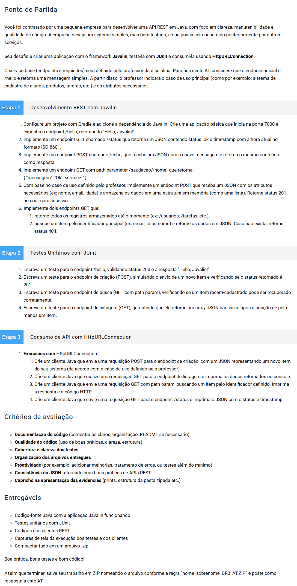

# Desenvolvimento de Serviços Web e Testes com Java
# AT - Questões (12)
Modo de Uso:
- Os exercícios do 1 ao 4 da Etapa1 estão no arquivo src>main>java>org>example>Etapa1
- Os exercícios 5 e 6 da Etapa1 estão no arquivo src>main>java>org>example>Tarefas>GerenciamentoDeTarefas.java.
- Todos os teste da Etapa2 dois estão no arquivo src>test>java>orgr>example>Etapa1Test
~~~~- Os Exercicios da Etapa3 estão no arquivo src>main>java>org>example>Etapa3 e para rodar eles você deve iniciar o servidor primeiro em Main.java

