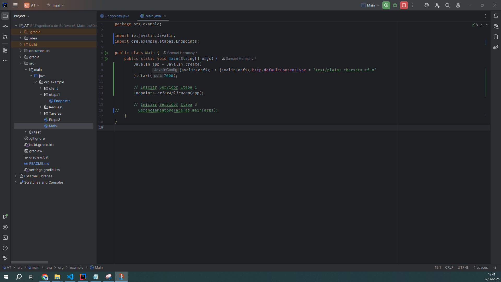
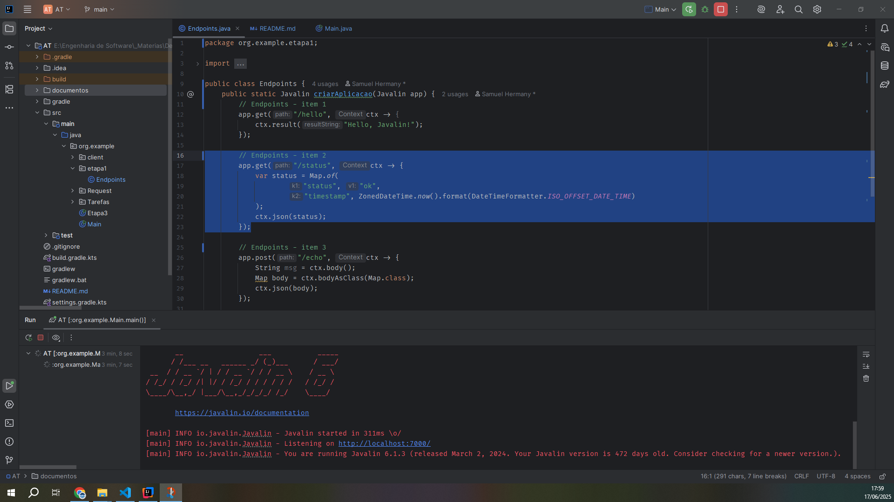
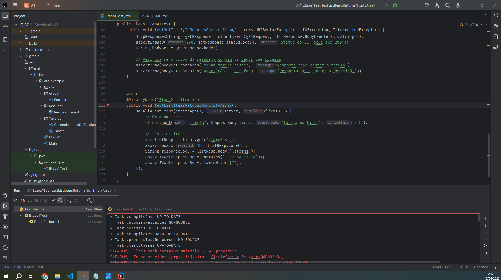

# Desenvolvimento de Serviços Web e Testes com Java
# Resolução da Etapa 1
### 1. Configure um projeto com Gradle e adicione a dependência do Javalin. Crie uma aplicação básica que inicia na porta 7000 e exponha o endpoint /hello, retornando "Hello, Javalin!". 
Código:

 Postman:

### 2. Implemente um endpoint GET chamado /status que retorna um JSON contendo status: ok e timestamp com a hora atual no formato ISO-8601. 
Código:

 Postman:

### 3. Implemente um endpoint POST chamado /echo, que recebe um JSON com a chave mensagem e retorna o mesmo conteúdo como resposta. 
Código:

 Postman:

### 4. Implemente um endpoint GET com path parameter /saudacao/{nome} que retorna:
{ "mensagem": "Olá, <nome>!" } 
Código:

 Postman:

### 5. Com base no caso de uso definido pelo professor, implemente um endpoint POST que receba um JSON com os atributos necessários (ex: nome, email, idade) e armazene os dados em uma estrutura em memória (como uma lista). Retorne status 201 ao criar com sucesso.
Código:

Classe Tarefa

 Postman:

### 6. Implemente dois endpoints GET que:
#### 1- retorne todos os registros armazenados até o momento (ex: /usuarios, /tarefas, etc.).
Código:

 Postman:

#### 2- busque um item pelo identificador principal (ex: email, id ou nome) e retorne os dados em JSON. Caso não exista, retorne status 404. 
Código:

 Postman:

# Resolução da Etapa 2
### 1. Escreva um teste para o endpoint /hello, validando status 200 e a resposta "Hello, Javalin!".
Código e Teste:

### 2. Escreva um teste para o endpoint de criação (POST), simulando o envio de um novo item e verificando se o status retornado é 201.
Código e Teste:

### 3. Escreva um teste para o endpoint de busca (GET com path param), verificando se um item recém-cadastrado pode ser recuperado corretamente.
Código:

Teste:

### 4. Escreva um teste para o endpoint de listagem (GET), garantindo que ele retorne um array JSON não vazio após a criação de pelo menos um item.
Código:

# Resolução da Etapa 3
Para testar Todos os exercicios da Etapa3 deixe descomentado conforme a imagem abaixo:

### 1. Crie um cliente Java que envie uma requisição POST para o endpoint de criação, com um JSON representando um novo item do seu sistema (de acordo com o caso de uso definido pelo professor).
Na classe Etapa3 no main deixe descomentado somente o exercicio que quer testar:

### 2. Crie um cliente Java que realize uma requisição GET para o endpoint de listagem e imprima os dados retornados no console.
Na classe Etapa3 no main deixe descomentado somente o exercicio que quer testar:

Código da requisição

### 3. Crie um cliente Java que envie uma requisição GET com path param, buscando um item pelo identificador definido. Imprima a resposta e o código HTTP.
Na classe Etapa3 no main deixe descomentado somente o exercicio que quer testar:

Código da requisição

### 4. Crie um cliente Java que envie uma requisição GET para o endpoint /status e imprima o JSON com o status e timestamp.Na classe Etapa3 no main deixe descomentado somente o exercicio que quer testar:
Na classe Etapa3 no main deixe descomentado somente o exercicio que quer testar:

Código da requisição
