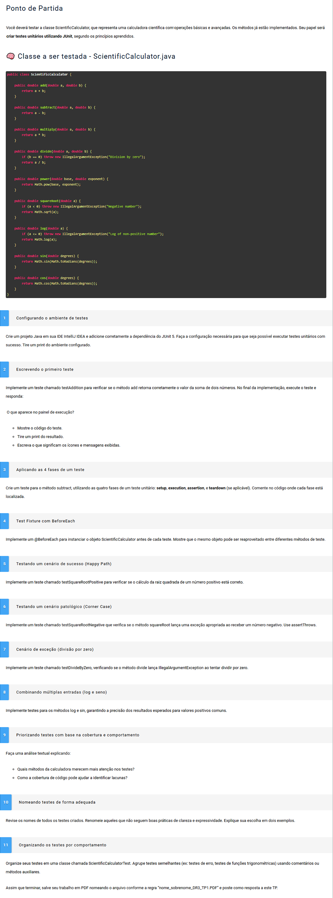

# Desenvolvimento de Serviços Web e Testes com Java
# TP1 - Questões (11)
Modo de Uso:
- No projeto existe uma classe ScientificCalculator.java "src>main>java>ScientificCalculator.java".
- O arquivo principal que é o arquivo de tetes encontra-se na pasta "rc>java>ScientificCalculatorTest.java". 
- Para executar os teste vá no arquivo acim e pression o play.

