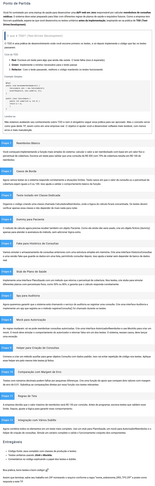

# Desenvolvimento de Serviços Web e Testes com Java

# TP2 - Questões (12)

Modo de Uso:

- No projeto existe um arquivo "src>main>java>CalculadoraReembolso.java", que é o arquivo principal do projeto.
- Para executar o código, basta abrir o arquivo CalculadoraReembolso.java e descomentar o exercício que deseja
  executar.

